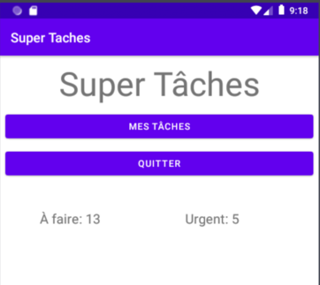
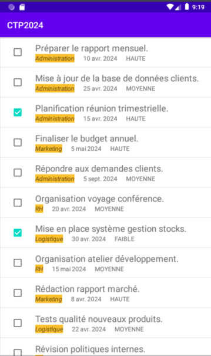
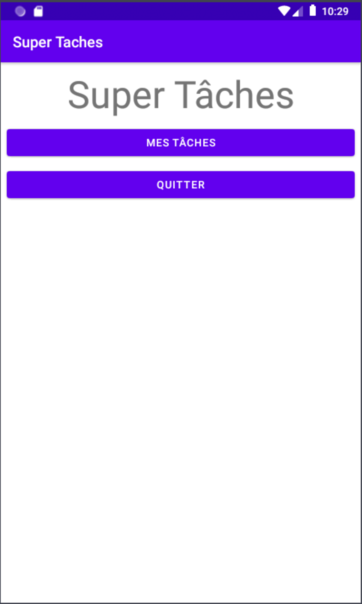

Ce contrôle TP est d'une durée de 2h. L’usage des documents papier, d'internet et des précédents TP sont
autorisés. **Attention: toute modification de votre dépôt strictement postérieure à
l'heure limite de la remise sera ignorée**. Vous devez bien entendu soumettre un travail
original, dont vous êtes l'unique auteur. 

---

# Description du projet

L'objectif de ce projet est de créer l'application (élémentaire) de gestion de tâches appelée `Super Tâches`.

Une tâche comprend:

- un nom (c'est-à-dire une description courte);
- une description longue;
- une catégorie;
- une date d'échéance;
- un status (`AFAIRE` ou `FAIT`);
- une priorité (`FAIBLE`, `MOYENNE` ou `HAUTE`).

L'application finale sera composée de deux activités:

- une activité d'accueil comprenant deux boutons permettant, respectivement, d'accèder à la liste des tâches et de quitter l'application; cette activité affiche également le nombre de tâches "à faire" et de tâches "urgentes";



- une activité qui liste les tâches et permet de les (dé)cocher afin de les basculer entre les status `FAIT` et à `AFAIRE`.



# Déroulement du contrôle

## Mise en place

Commencez par `fork` ce dépôt. **Assurez-vous qu'il est privé** (sinon, sur la page de votre fork sur gitlab, allez dans `Settings` --> `General` --> `Visibility, project features, permissions` --> `expand` --> `Project visibility` --> sélectionner `Private`).

### Invitez immédiatement votre enseignant comme membre **DEVELOPPEUR** sur votre dépôt gitlab (que vous venez juste de fork)

Ce dépôt contient:

- ce sujet de contrôle TP
- l'ensemble des sources et ressources dont vous aurez besoin pour ce contrôle.

Vous n'arriverez peut-être pas au bout de ce contrôle volumineux. Pas de panique! Le barème sera sur plus de 20 points.

Un jeu d'essai est préchargé à partir du fichier json (présent comme une ressource 'raw' de nom cand.json).

la commande

```{shell}
/usr/local/virtual_machine/infoetu/android/<login>/Sdk/platform-tools/adb install ./demo.apk
```

exécutée depuis le volet 'Terminal' installe une version complète du programme sur votre android virtuel (pensez évidemment à remplacer `<login>` par votre login).

## Restitution

Vous enregistrerez l'état de votre projet après chaque question (votre projet doit compiler et être fonctionnel).

```{shell}
git commit -am 'Question X'
git tag Qx
git push --tag # peut être éventuellement différé en fin de tp
```

## Rappels git

La commande:

```{shell}
git config --global credential.helper cache
```

vous évitera d'avoir à ressaisir vos identifiants/mot de passe à chaque fois.

Les commandes suivantes vous permettront de compléter une question déjà validée (par exemple la Qx):

```{shell}
git tag -d Qx
git commit -am 'Question X (complément)'
git tag Qx
git push --tag # peut être éventuellement différé en fin de tp
```


# Questions

Le modèle de tâches (classe `Tache`) est fourni ainsi que la classe `TacheApplication` qui, notamment, extrait les informations depuis le fichier de ressources json `res/raw/des_taches` contenant un jeu d'exemples de tâches. Jetez un oeil à ces deux classes. La classe `TacheApplication` contient en particulier les méthodes `getTaches` et `getCategories`. 

## Q1 - Affichage dans le Logcat
Avant tout, vérifier que les informations sont bien extraites du fichier
`raw/des_taches`. Pour cela, afficher la liste des tâches et des catégories dans
le `Logcat` (en priorité `INFO`).

## Q2 - Page d'accueil

> Avant de passer à cette question, n'oubliez pas de `commit` la précédente.

Définir un layout pour la page d'accueil sur ce modèle:



avec un titre "Super Tâches" et deux boutons: 

- "Mes tâches" permettant d'accéder à la liste des tâches, et
- "Quitter" permettant de quitter l'application.

_Pour l'instant on ne demande pas d'afficher les nombres de tâches "à faire" et urgentes_.

Modifiez le code de la classe `MainActivity` pour afficher ce layout à l'aide de `ViewBindings`.

## Q3 - Quitter l'application avec le bouton `Quitter`

> Avant de passer à cette question, n'oubliez pas de `commit` la précédente.

Implémenter l'action associée au bouton "Quitter". Cliquer sur ce bouton fermera donc l'activité (on ne cherchera pas à complétement quitter l'application. Retourner à l'écran d'accueil Android sera suffisant).

## Q4 - Affichage du nombre de tâches en cours et urgentes

> Avant de passer à cette question, n'oubliez pas de `commit` la précédente.

Ajouter, sous le bouton "Quitter", des champs texte qui affichent le nombre de tâches en cours (c'est-à-dire avec le status `AFAIRE`) et le nombre de tâches urgentes (c'est-à-dire de priorité `HAUTE`).

## Q5 - Accès à une 2ème activité avec le bouton `Mes tâches`

> Avant de passer à cette question, n'oubliez pas de `commit` la précédente.

Créer une nouvelle activité `TacheActivity` et son layout `activity_tache.xml` qui permettront (dans la question suivante) d'afficher la liste des tâches. Faites-en sorte que le bouton "Mes tâches" permette d'accèder à cette nouvelle activité (une page blanche pour l'instant).

## Q6 - Liste des tâches dans la 2ème activité

> Avant de passer à cette question, n'oubliez pas de `commit` la précédente.

Créer un layout pour l'affichage d'un item de la liste des tâches. Ce layout comprendra une case à cocher (`checkbox`) représentant le status de la tâche, ainsi que les autres informations sous forme textuelle à l'exception de la description longue. Dans un premier temps vous réaliserez un layout rudimentaire que vous pourrez améliorer en fin de contrôle si vous avez le temps. Programmez les classes `TacheViewHolder` et `TacheAdapter`, et modifiez le reste du code pour permettre l'affichage de la liste des tâches (pour l'instant on ne tient pas compte du comportement de la case à cocher).

## Q7 - Bascule `AFAIRE`/`FAIT` des tâches via la case à cocher

> Avant de passer à cette question, n'oubliez pas de `commit` la précédente.

Faites en sorte que lorsqu'on coche la `checkbox` d'une tâche le status de cette case bascule en `FAIT` (resp. `AFAIRE`) si la case était précédemment cochée (resp. décochée). Pour ce faire, vous pourrez utiliser la méthode `setOnCheckedChangeListener` pour passer le callback qui gère le clic sur la `checkbox`. Pour vérifier que votre implantation est correcte, après avoir coché une tâche, revenez sur la page d'accueil à l'aide du bouton `Back`, puis à nouveau sur la liste des tâches avec le bouton "Mes Tâches" et la tâche cochée devrait toujours l'être.

## Q8 - Mise-à-jour des statistiques

> Avant de passer à cette question, n'oubliez pas de `commit` la précédente.

Faites en sorte que, depuis l'activité d'affichage des tâches, le retour à l'activité d'acceuil mette à jour le nombre de liste à faire si celui-ci a changé.